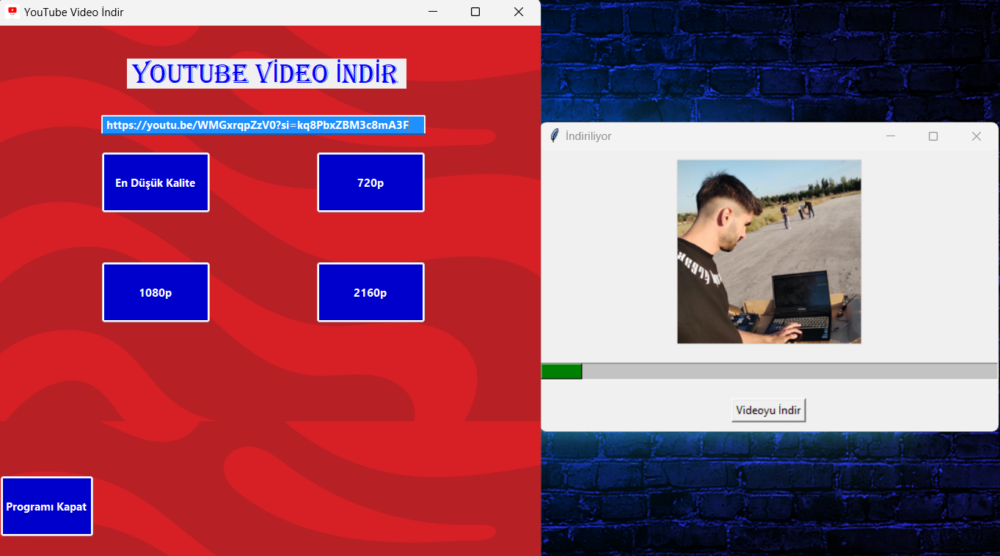
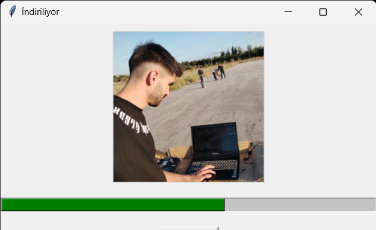

# YouTube Video İndirme Programı (C# + Python)

## Proje Hakkında

Bu proje, **Python** ve **C#** dillerini bir arada kullanarak YouTube videolarını indirmenizi sağlar. Proje, Python’un güçlü video indirme kütüphanesi **pytube** ile video indirme işlemi yaparken, C# ile oluşturulmuş bir **Windows Forms** uygulaması üzerinden kullanıcı arayüzü (GUI) sunar. Bu sayede, Python ve C# arasında bir iş birliği sağlanarak, her iki dilin avantajları birleştirilmiştir.

Proje, Python ve C#'ın entegrasyonu ile ilgili bir örnek sunmak amacıyla geliştirilmiştir. Python, arka planda video indirme işlemini gerçekleştirirken, C# uygulaması kullanıcılara görsel bir arayüz sağlar.

---
## Kullanılan Teknolojiler

- **Python**:
  - **pytube**: YouTube videolarını indirmek için kullanılır.
  - **tkinter**: Python GUI geliştirme için kullanılır.
  - **Pillow**: Görselleri işlemek için kullanılır (video indirme işlemi sırasında görsel göstermek amacıyla).
  
- **C#**:
  - **Windows Forms**: Kullanıcı arayüzü geliştirmek için kullanılır.
  - **ProcessStartInfo**: Python script'ini C# içinden çalıştırmak için kullanılır.
  
---
## Proje Yapısı

Proje, her iki dili bir arada kullanarak YouTube videosu indirme işlevini yerine getiren basit bir uygulamadır. C# ile yapılan **GUI**, kullanıcının video linki girmesini sağlar ve ardından seçilen kaliteye göre Python script'ini çalıştırır. Python script'i, **pytube** kütüphanesi aracılığıyla YouTube videosunu indirir.

### C# Uygulaması (Windows Forms)
- Kullanıcı, bir **TextBox** aracılığıyla YouTube video URL'sini girer.
- Video kalitesini seçmek için dört adet **Button** bulunur: 
  - En Düşük Kalite
  - 720p
  - 1080p
  - 2160p (4K)
- Seçilen kaliteye göre Python script'i çalıştırılır ve video indirme işlemi başlatılır.
- İndirme sırasında bir progress bar ile ilerleme gösterilir.



### Python Script
- **pytube** kütüphanesi kullanılarak video indirme işlemi gerçekleştirilir.
- İndirme sırasında ilerleme durumu GUI'ye aktarılır.
- İndirme tamamlandığında, video dosyası belirtilen dizine kaydedilir.

## Kurulum ve Çalıştırma

### Adım 1: Python Ortamını Kurma
- Python yüklü değilse, [Python İndir](https://www.python.org/downloads/) sayfasından Python'u indirip yükleyin.
- Gerekli Python kütüphanelerini yüklemek için aşağıdaki komutları çalıştırın:

```bash
pip install pytube pillow
```

---
### Adım 2: C# Uygulamasını Çalıştırma

1. **Visual Studio**'yu açın ve proje dosyasını (`YouTubeVideoİndir.sln`) yükleyin.
2. C# uygulamanızın çalışabilmesi için **Python** yolu ve **script dosyası yollarının** doğru bir şekilde ayarlandığından emin olun.
   - `YouTube.py` dosyasının tam yolu ve Python yorumlayıcısının yolu, C# kodunda doğru şekilde belirtilmiş olmalıdır.
   - Eğer Python ve script dosyaları farklı bir dizinde ise, bu yolları `Form1.cs` dosyasındaki `start.FileName` ve `start.Arguments` kısımlarında güncellemeniz gerekecektir.
   
3. Projeyi **Çalıştır** (F5) tuşuna basarak başlatın.
   - C# Windows Forms uygulaması açıldığında, YouTube video URL'si girmek için bir **TextBox** ve video kalitesini seçmek için dört adet **Button** göreceksiniz.
   
4. Video URL'sini **TextBox**'a girin ve ardından video kalitesini seçmek için bir **Button**'a tıklayın:
   - **En Düşük Kalite**: En düşük çözünürlükte video indirir.
   - **720p**: 720p çözünürlükte video indirir.
   - **1080p**: 1080p çözünürlükte video indirir.
   - **2160p (4K)**: 4K çözünürlükte video indirir.

5. Uygulama, seçilen kaliteye göre **Python script**'ini çalıştıracak ve video indirilmeye başlanacaktır.
   - İndirme ilerlemesi, **progress bar** aracılığıyla GUI'de görüntülenecektir.
   - İndirme tamamlandığında, video dosyası belirtilen dizine kaydedilecektir.

---
### Adım 3: Video İndirme

- **Python**: Python script'i, aşağıdaki gibi çalıştırılarak YouTube'dan video indirilebilir:

```bash
python YouTube.py <video_url> <quality>
```



**C#:** C# uygulaması üzerinden, TextBox'a video URL'si girilip, Button'a tıklanarak video indirme başlatılır. Python script'i arka planda çalışarak video indirme işlemini gerçekleştirir.

---

### Ekstra Bilgiler

* **Geliştirici**: [Fatih AYIBASAN] (Bilgisayar Mühendisliği Öğrencisi)
* **E-posta**: [fathaybasn@gmail.com]

---